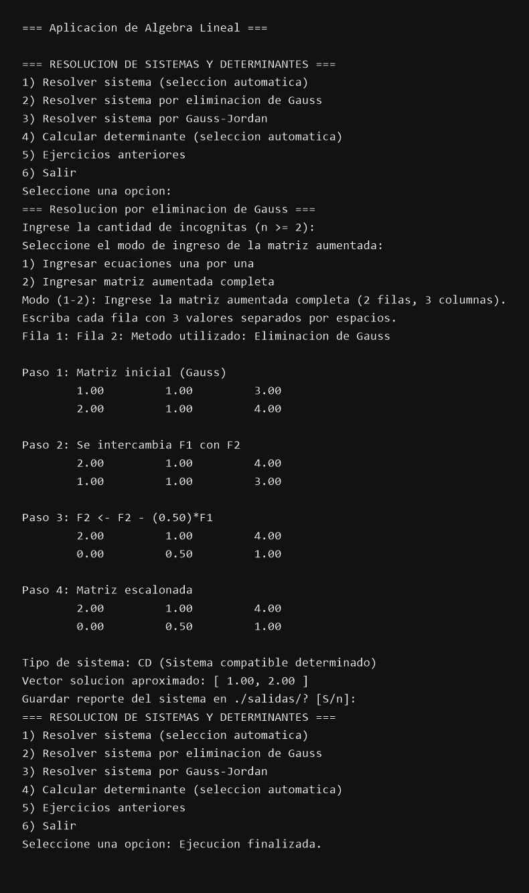
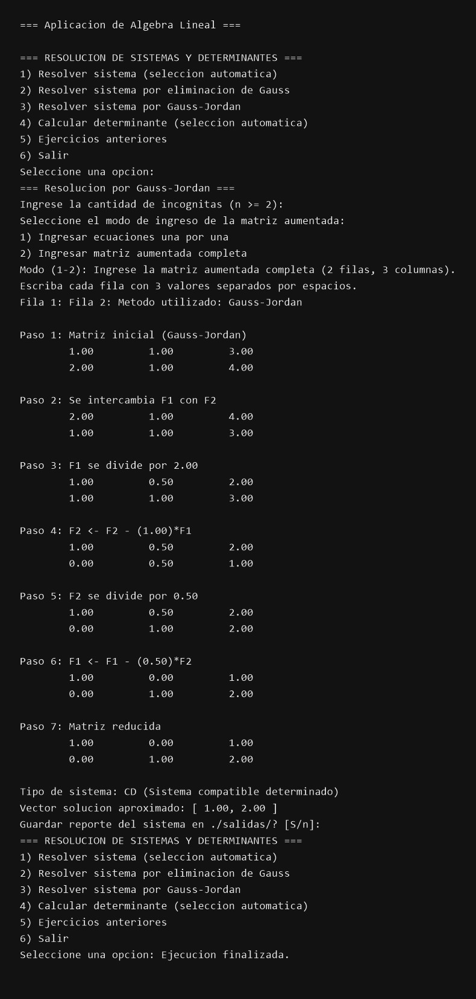
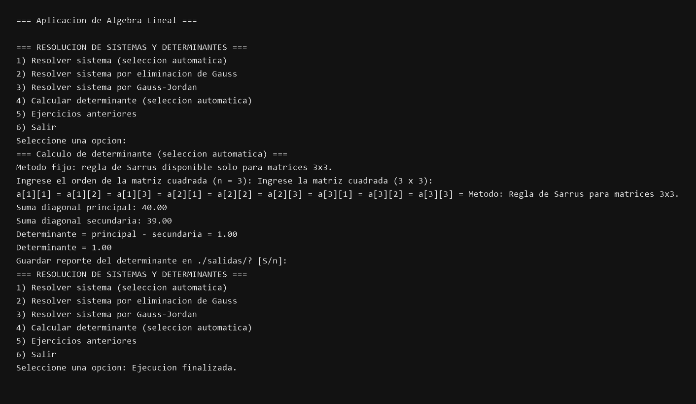
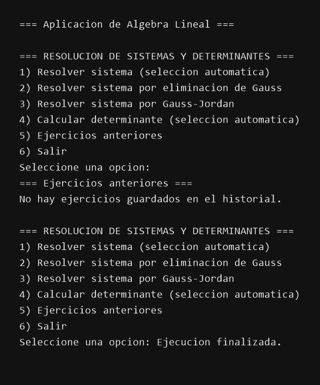

## Características principales
- Menú guiado que permite elegir entre resolución automática, Gauss, Gauss-Jordan o cálculo de determinantes.
- Selección inteligente del método (Gauss o Gauss-Jordan) según el orden del sistema e indicaciones en cada paso.
- Reportes exportables .txt con el detalle de todas las operaciones realizadas.

## Funciones principales del programa
- `resolverSistemaAutomatico` (`src/resolver.cpp`): analiza el tamaño del sistema y decide si conviene Gauss o Gauss-Jordan, guardando los pasos intermedios.
- `resolverPorGauss` (`src/resolver.cpp`): implementa la eliminación hacia adelante con pivoteo parcial .
- `resolverPorGaussJordan` (`src/resolver.cpp`): obtiene la forma reducida, normaliza pivotes y documenta cada operación elemental.
- `determinanteAutomatico` (`src/determinante.cpp`): aplica la regla de Sarrus sobre matrices 3x3 y devuelve el detalle textual del procedimiento.
- `mostrarPasos` y utilidades de entrada/salida (`src/entrada_salida.cpp`): formatean la matriz aumentada, validan entradas numéricas y coordinan la escritura de reportes en `./salidas/`.

## Capturas del funcionamiento

Resolucion automatica con seleccion del metodo segun el tamano del sistema y vector solucion final.

Aplicacion directa de la eliminacion de Gauss.

Proceso completo de Gauss-Jordan hasta obtener la matriz reducida y el vector solucion.

Calculo de la determinante 3x3 aplicando Sarrus.

Visualizacion del historial de ejercicios almacenados (en este caso vacio).

## Idea de la web complementaria
A pesar de que no formó parte del ejercicio original, planificamos una versión web. La propuesta es convertir la consola en una plataforma educativa: cargar sistemas desde el navegador, recibir retroalimentación visual de cada pivote y generar fichas descargables para repasar.

👉 [Ver sitio en línea](https://nicoo01x.github.io/Resolucion-Sistemas-Ecuaciones-Web/)

## Estructura del repositorio
- `src/`: código fuente principal de la aplicación de consola.
- `bin/`, `obj/`: artefactos generados por Visual Studio durante la compilación.

